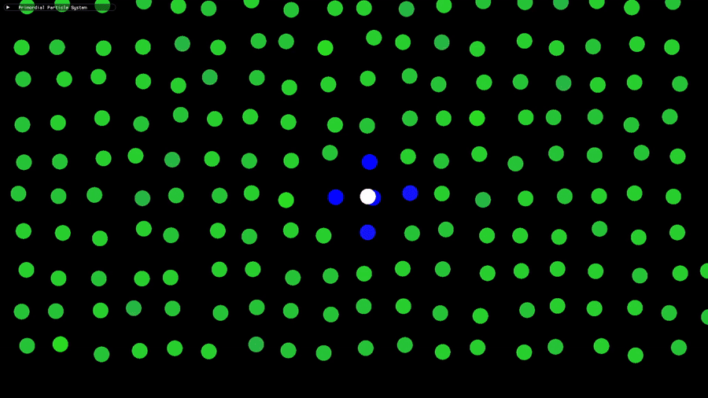
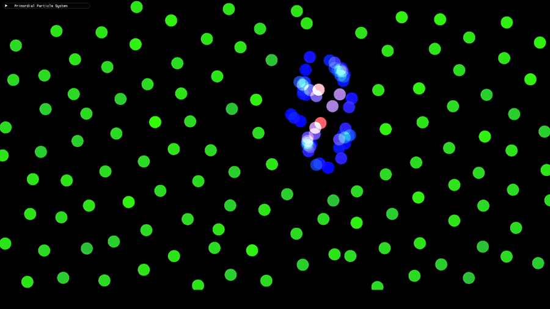

<div align="center">




<br/>

# Primordial Particle System

**A high-performance C++ simulation of emergent life — over 1,000,000 particles, 3 rules.**

<br/>


<br/>

<a href="https://youtu.be/nR8ml9kxekY?si=__-0RhOJBVFLgDBu">
  
  <br/>
  
</a>

</div>

<br/>

---

## What is the Primordial Particle System?

The Primordial Particle System is a zero-intelligence particle model originally designed by the [Artificial Life Lab Graz](https://alife.uni-graz.at/projects/primordial-particle-systems/). Each particle follows three local rules based on its immediate neighbours. Together they produce complex lifelike behaviour: swarming, clustering, rotating rings, and chain-like structures that emerge from chaos.

> **No global Update rules, Every particle acts independently based on local information.**

<br/>

---

## Showcase

<!-- ============================================================
     INSERT: 3 side-by-side GIFs or images showing different
     emergent behaviours. Suggested captions below match what you
     should try to capture. Each should be ~280x280px, looping.
     Place in /media folder.
     ============================================================ -->

| Reproduction | Survival | Death |
|:-:|:-:|:-:|
|  |  |  |
| *Self-Replicating*                      | *Self-Sustaining* | *1M+ particles, real-time* |
| *moving as one body* | *with no central logic* | *running on a single machine* |

<br/>

---

## Features

- **1,000,000+ particles** running in real-time (10,000,000 at 10fps)
- **Multithreaded** update loop with a custom thread pool
- **Spatial hash grid** for O(1) average-case neighbour lookup
- **Live parameter tuning** — adjust α, β, and speed mid-simulation
- **Colourised by local density** — sparse particles are dim, dense clusters glow
- **SFML rendering** with batched draw calls for minimal GPU overhead
- **Configurable via TOML** — no recompiling to tweak settings

<br/>

---

## The Rules

Each particle has a position and a heading angle φ. Every tick:

```
N  = number of neighbours within radius r
R  = neighbours to the right
L  = neighbours to the left

φ  +=  α  +  β × N × sign(R - L)
```

`α` and `β` are the only two parameters. Everything you see in the simulation is a result of these four lines.

<br/>

---

## Performance Benchmarking

| Particle Count | Resolution | FPS (avg) | Hardware |
|:-:|:-:|:-:|:-:|
| 100,000    | 1920×1080 | ~60 | i5 / GTX 1060 |
| 500,000    | 1920×1080 | ~70 | i7 / RTX 4080 |
| 1,000,000+ | 1920×1080 | ~90 | i9 / RTX 5060 |


Key optimisations:
- **Spatial hashing** replaces O(n²) neighbour search with near-O(1) grid lookups
- **Half-grid traversal** eliminates redundant symmetric pair checks
- **Thread pool** distributes particle updates across all available cores
- **Batched SFML rendering** — all particles drawn in a single `VertexArray` pass

<br/>

---

## Getting Started

### Prerequisites

- C++17 compiler (MSVC, GCC, or Clang)
- [CMake](https://cmake.org/) 3.16+
- [SFML 2.6](https://www.sfml-dev.org/)
- [toml++](https://github.com/marzer/tomlplusplus) *(included as a header)*

### Building on Windows

```bash
git clone https://github.com/curtis-aln/Primordial-Particle-System.git
cd Primordial-Particle-System
cmake -S . -B build -DCMAKE_BUILD_TYPE=Release
cmake --build build --config Release
```

### Building on Linux

```bash
sudo apt install libsfml-dev
git clone https://github.com/curtis-aln/Primordial-Particle-System.git
cd Primordial-Particle-System
cmake -S . -B build -DCMAKE_BUILD_TYPE=Release
cmake --build build
```

> **Note:** SFML must be installed and findable by CMake. On Windows, set `SFML_DIR` in your CMake config to the SFML install path if it isn't auto-detected.

<br/>

---

## Controls

| Key / Input | Action |
|:--|:--|
| `Space` | Pause / Resume |
| `R` | Reset simulation |
| `Scroll` | Zoom in / out |
| `Middle Mouse` | Pan camera |
| `+` / `-` | Increase / decrease particle count |
| `F` | Toggle FPS display |

<!-- ============================================================
     INSERT: Fill in the actual controls from your codebase.
     Add or remove rows as needed. If you have an ImGui panel,
     mention it here too.
     ============================================================ -->

<br/>

---

## Configuration

Settings are loaded from `settings.toml` in the project root. Key parameters:

```toml
[simulation]
particle_count = 100000
radius         = 5.0
alpha          = 180.0   # degrees
beta           = 17.0    # degrees
speed          = 0.67

[rendering]
window_width   = 1920
window_height  = 1080
target_fps     = 60
```

<!-- ============================================================
     INSERT: Copy settings.toml structure here.
     Replace the values above with whatever your real defaults are.
     ============================================================ -->

<br/>

---

## Acknowledgements

- **Primordial Particle System** — original model by [Artificial Life Lab Graz](https://alife.uni-graz.at/projects/primordial-particle-systems/)
- Paper: *"How a life-like system emerges from a simple particle motion law"* — Schmickl et al.
- Built with [SFML](https://www.sfml-dev.org/) and [toml++](https://github.com/marzer/tomlplusplus)

<br/>

---

## License

Distributed under the MIT License. See [`LICENSE`](LICENSE) for details.

<br/>

<div align="center">
  <sub>Built by <a href="https://github.com/curtis-aln">curtis-aln</a></sub>
</div>